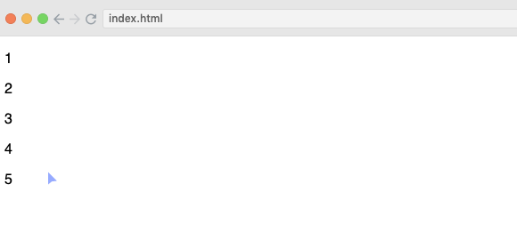

# Data Loading and Binding

```js
// javascript
var dataset = [1, 2, 3, 4, 5];

d3.select('body')
    .selectAll('p')
    .data(dataset)
    .enter()
    .append('p') // appends paragraph for each data element
    //.text('D3 is awesome!!');
    .text(function(d) { return d; });
```


